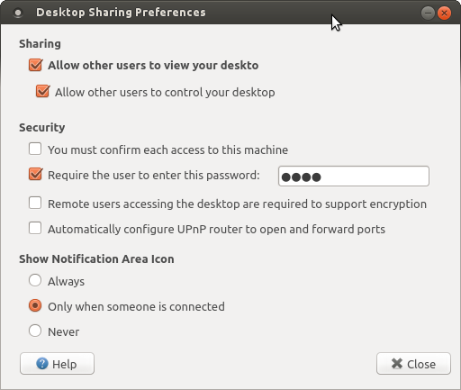

vino-preferences-qt
===================

A Qt5 QML clone of GNOME2's vino-preferences.

Requirements:
  * Qt >= 5.1.0
  * Python >= 3.3.0
  * pyotherside >= 1.2.0

``` bash
qmlscene vino-preferences-qtpy.qml -style gtk
```


